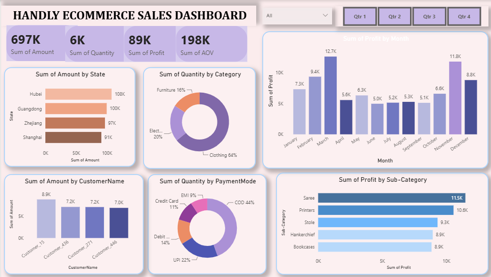

# 📊 HANDLY E-Commerce Sales Dashboard

An interactive **Power BI dashboard** designed to analyze e-commerce sales performance, profitability, customer behavior, and business trends.

<br>

## 📌 Overview

The **HANDLY E-Commerce Sales Dashboard** is an interactive Business Intelligence solution built using **Power BI**. It transforms raw e-commerce data into meaningful insights through interactive visualizations, KPIs, and filters.

The dashboard enables users to monitor sales performance, evaluate profitability, identify top-performing products and customers, analyze regional performance, and explore business trends.

<br>

## 🖼️ Dashboard Preview

> *Add your dashboard screenshot here.*



<br>

## 🎯 Objectives

- Monitor overall business performance.
- Analyze sales, profit, and quantity sold.
- Compare sales across different states.
- Evaluate product category performance.
- Track monthly profit trends.
- Analyze customer purchasing behavior.
- Understand payment mode distribution.

<br>

## 📊 Key Metrics

- 💰 Total Sales
- 📈 Total Profit
- 📦 Total Quantity Sold
- 🛒 Average Order Value (AOV)

<br>

## ✨ Dashboard Highlights

- Interactive KPI cards for business monitoring.
- Dynamic slicers for filtering and exploration.
- State-wise sales analysis.
- Monthly profit trend visualization.
- Category and sub-category performance analysis.
- Customer-wise sales insights.
- Payment mode distribution.
- Clean and intuitive dashboard layout.

<br>

## 🛠️ Tools & Technologies

- Power BI Desktop
- Power Query
- DAX (Data Analysis Expressions)
- Data Modeling
- Data Visualization

<br>

## 📂 Dataset

The dashboard is built using an e-commerce sales dataset containing:

- Orders
- Customers
- Products
- Categories
- Sub-Categories
- States
- Sales
- Profit
- Quantity
- Payment Mode

<br>

## 📈 Business Insights

This dashboard helps answer business questions such as:

- Which states generate the highest sales?
- Which product categories contribute the most revenue?
- How does profit vary across different months?
- Which customers generate the highest sales?
- Which payment methods are most frequently used?

<br>

## 🚀 Getting Started

1. Clone this repository.
2. Open `HANDLY_Ecommerce_Sales_Dashboard.pbix` using **Power BI Desktop**.
3. Refresh the data if required.
4. Use the interactive slicers to explore business insights.

<br>

## 💡 Skills Demonstrated

- Data Cleaning
- Data Transformation
- Data Modeling
- DAX Measures
- KPI Development
- Interactive Dashboard Design
- Business Intelligence
- Data Visualization

<br>

## 📁 Repository Structure

```text
HANDLY_Ecommerce_Sales_Dashboard/
│
├── HANDLY_Ecommerce_Sales_Dashboard.pbix
├── HANDLY DASHBOARD PREVIEW.png
└── README.md
```
